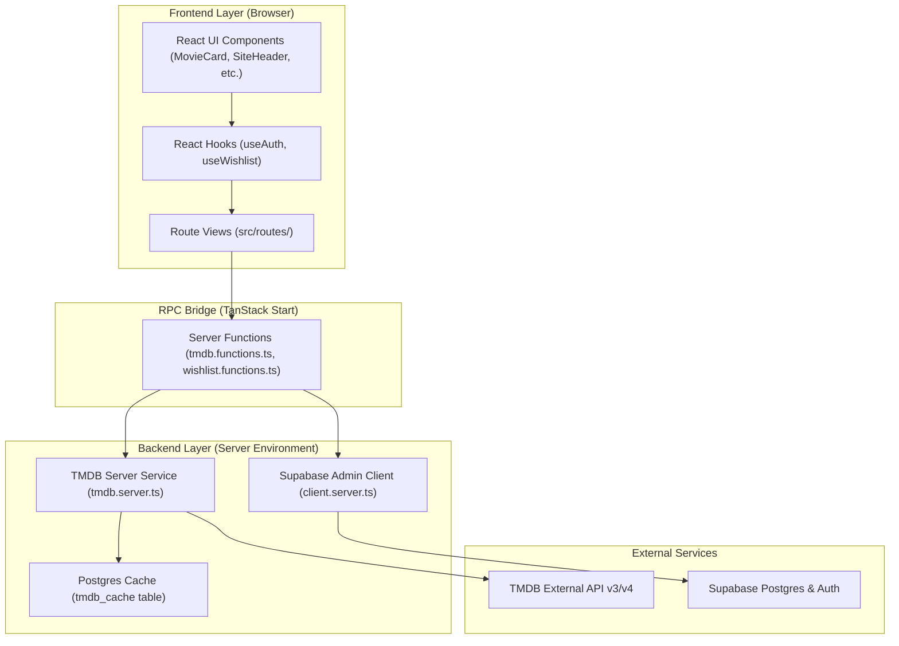

# Codebase Architecture & System Design

This document provides a complete guide to the architecture, layer separation, data flow, and directory structure of **Cineframe (reel-discover-pro)**.

---

## 1. High-Level Architecture Overview

The application is built using a modern full-stack architecture powered by **TanStack Start**, **Vite**, **React 19**, **Tailwind CSS**, and **Supabase**.

To maintain clean separation of concerns and high maintainability, the codebase is strictly partitioned into clear architectural layers:



---

## 2. Directory Layout & Layer Responsibilities

```text
reel-discover-pro/

├── src/
│   ├── frontend/                  # FRONTEND LAYER (Client Presentation UI)
│   │   ├── components/            # React UI Components
│   │   │   ├── MovieCard.tsx      # Movie display cards, skeletons & grid containers
│   │   │   ├── SiteHeader.tsx     # Site navigation header & user auth state
│   │   │   ├── StateMessage.tsx   # Generic empty state & error banner display
│   │   │   └── ui/                # Reusable Radix UI & Shadcn primitive components
│   │   ├── hooks/                 # React Custom Hooks
│   │   │   ├── useAuth.ts         # User authentication state & session hook
│   │   │   ├── useWishlist.ts     # Client wishlist query & mutation logic (React Query)
│   │   │   ├── useDebouncedValue.ts # Input debouncing hook for search
│   │   │   └── use-mobile.tsx     # Mobile viewport detection hook
│   │   └── index.ts               # Barrel export for frontend components & hooks
│   │
│   ├── backend/                   # BACKEND LAYER (Server Logic & RPC Endpoints)
│   │   ├── tmdb.server.ts         # TMDB API access, response normalization & PostgreSQL caching
│   │   ├── tmdb.functions.ts      # Server RPC functions for movie browsing & details
│   │   ├── wishlist.functions.ts  # Server RPC functions for user wishlist CRUD
│   │   └── index.ts               # Barrel export for backend server functions
│   │
│   ├── shared/                    # SHARED LAYER (Types, DTOs & Constants)
│   │   ├── tmdb-types.ts          # Normalized Movie, Detail, Page & Genre interfaces
│   │   └── index.ts               # Barrel export for shared data structures
│   │
│   ├── integrations/              # THIRD-PARTY INTEGRATION HELPERS
│   │   └── supabase/              # Supabase Client, Auth middleware, and Server Admin
│   │
│   ├── routes/                    # ROUTING LAYER (TanStack Router View Controllers)
│   │   ├── __root.tsx             # Root layout shell, query client provider & header
│   │   ├── index.tsx              # Home / Movie Discovery Page
│   │   ├── auth.tsx               # Authentication modal/page
│   │   ├── movie.$movieId.tsx     # Movie Details Page
│   │   └── _authenticated/        # Authenticated routes (Wishlist Page)
│   │       └── wishlist.tsx       # User Wishlist View
│   │
│   ├── lib/                       # SHARED UTILITIES
│   │   ├── utils.ts               # Tailwind class merge helper (cn)
│   │   ├── error-capture.ts       # Global error logger
│   │   └── error-page.ts          # Fallback error page UI
│   │
│   ├── router.tsx                 # TanStack Router instance & configuration
│   ├── server.ts                  # Server entrypoint (Nitro / SSR execution environment)
│   └── start.ts                   # Client entrypoint
│
├── drizzle/                       # Database schema migrations & config
├── public/                        # Static assets (favicons, icons)
├── .env                           # Environment variables configuration
├── package.json                   # Project scripts and dependencies
└── tsconfig.json                  # TypeScript compiler settings
```

---

## 3. Core Architectural Rules

### 1. Zero Direct API Leakage to the Client

* The browser **never** talks directly to TMDB API endpoints.
* All requests flow through `src/backend/tmdb.functions.ts` server functions.
* `TMDB_API_KEY` stays strictly on the server node environment.

### 2. Payload Normalization

* Upstream TMDB payloads can be incomplete or inconsistent.
* `src/backend/tmdb.server.ts` normalizes all raw API payloads into strongly typed `MovieSummary` or `MovieDetail` shapes defined in `src/shared/tmdb-types.ts`.

### 3. Server-Side Caching & Resiliency

* TMDB API responses are cached in Supabase Postgres (`tmdb_cache` table).
* Frequent requests, such as popular movies or genre lists, serve cached data instantly.
* In case of TMDB rate limits (HTTP 429) or upstream outage, stale cached data is served automatically to preserve UX.

### 4. Authenticated RPC Middleware

* Wishlist operations (`listWishlistFn`, `addToWishlistFn`, `removeFromWishlistFn`) are protected by `requireSupabaseAuth` middleware in `src/backend/wishlist.functions.ts`.
* Requests automatically validate the user's Supabase access token before executing database operations.

---

## 4. How to Develop & Extend

### Adding a New Backend RPC Endpoint

1. Define any shared types or schemas in `src/shared/tmdb-types.ts`.
2. Implement server-only logic or database queries in `src/backend/tmdb.server.ts` or `src/backend/wishlist.functions.ts`.
3. Wrap the server handler with `createServerFn({ method: "GET" | "POST" })` and `.validator(...)`.
4. Re-export the function in `src/backend/index.ts`.

### Adding a New Frontend Component or View

1. Place reusable UI elements in `src/frontend/components/` or `src/frontend/components/ui/` for primitives.
2. Place custom hooks in `src/frontend/hooks/`.
3. Re-export them via `src/frontend/index.ts`.
4. Import server functions using `useServerFn(functionName)` and `useQuery` / `useMutation` inside your route component.
